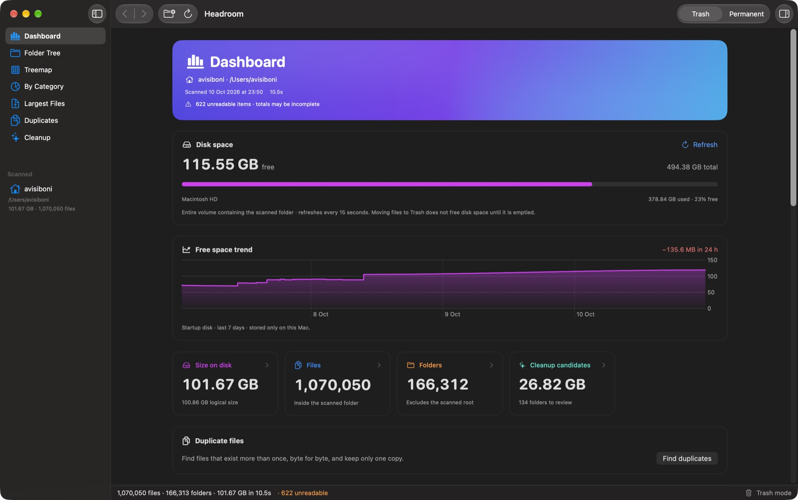
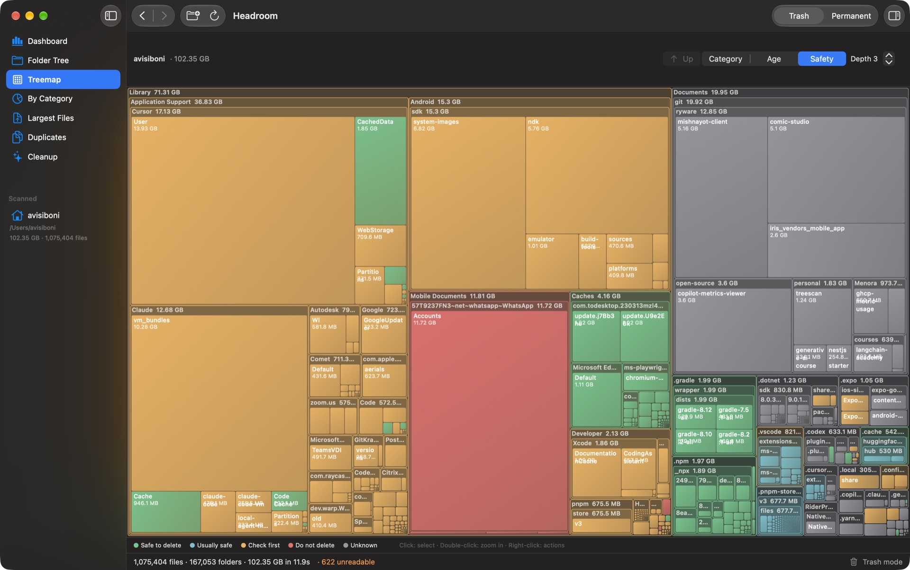
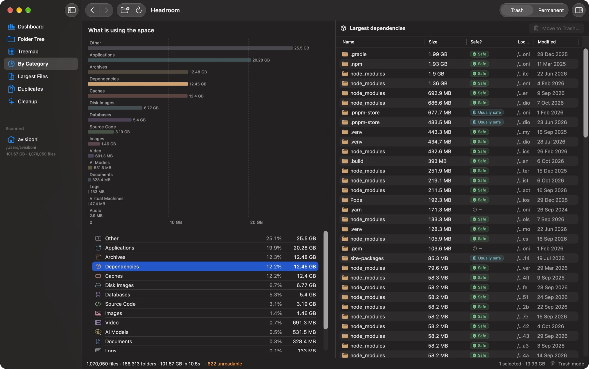
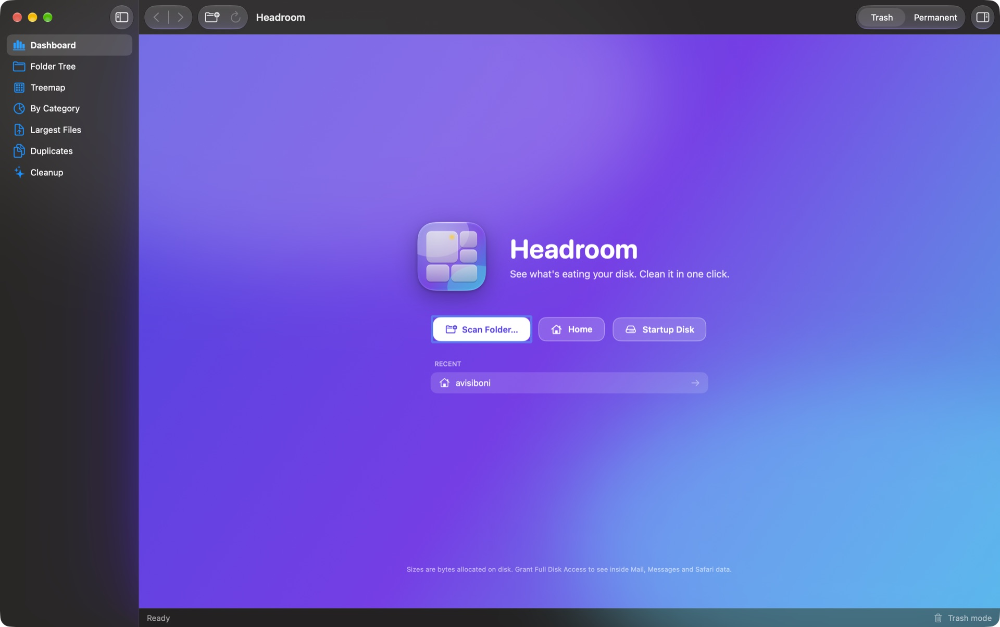
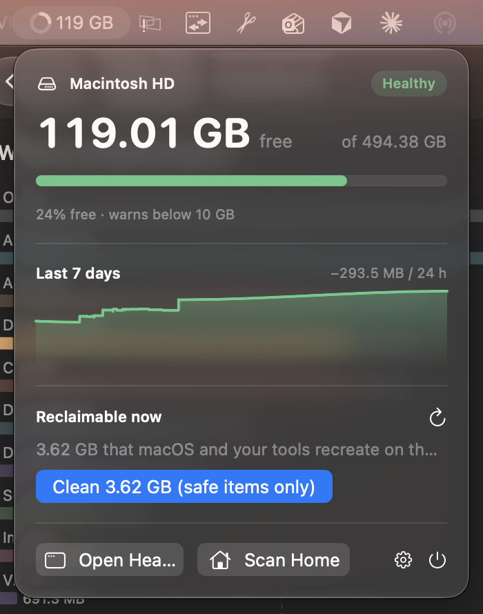

# Headroom

<p align="center">
  
</p>

<h3 align="center">See what is eating your Mac's disk. Give it some headroom.</h3>

<p align="center">
  A fast, native macOS disk space analyzer, storage visualizer, and cleanup utility.<br>
  <strong>Completely free. No subscription, ads, tracking, accounts, or in-app purchases.</strong><br>
  <sub>Formerly DiskTree. Same app, same bundle id, new name since 1.0.</sub>
</p>

<p align="center">
  <a href="https://github.com/Ryware/Headroom/actions/workflows/build.yml"></a>
  <a href="https://github.com/Ryware/Headroom/actions/workflows/build.yml"></a>
  <a href="https://github.com/Ryware/Headroom/actions/workflows/build.yml"></a>
  <a href="https://github.com/Ryware/Headroom/actions/workflows/build.yml"></a>
  <br>
  <a href="https://github.com/Ryware/Headroom/releases/latest"></a>
  <a href="https://github.com/Ryware/Headroom/releases"></a>
  
  
  
  <br>
  
  
  
  <a href="LICENSE"></a>
  <a href="https://github.com/Ryware/Headroom/stargazers"></a>
</p>

<p align="center">
  <a href="../../releases/latest"><strong>Download the latest release</strong></a>
  ·
  <a href="#build-from-source">Build from source</a>
  ·
  <a href="#safety-and-privacy">Safety & privacy</a>
</p>



Headroom turns a crowded drive into an understandable map. Scan a folder or disk, identify the largest files and developer caches, inspect what is safe to remove, and clean up without leaving the app.

## Why Headroom

- **Find space fast** — a native scanner uses macOS `getattrlistbulk(2)` and parallel directory traversal.
- **Understand it visually** — explore a detailed folder tree, a squarified treemap, file categories, and the largest individual files and bundles.
- **Delete with context** — safety badges explain what an item is, whether it is usually safe to remove, and what deletion may affect.
- **Clean developer clutter** — discover caches, DerivedData, `node_modules`, package stores, build output, logs, virtual machines, and other regenerable data.
- **Find duplicates** — byte-for-byte identical files (size → header hash → samples → full SHA-256), grouped and ranked by reclaimable space, with one-click "keep newest" selection and a keep-one-copy guard.
- **Watch it from the menu bar** — a live free-space ring, 7-day trend, low-space and sudden-drop alerts, and one-click cleanup of safe caches.
- **Stay in control** — choose recoverable Trash mode or an explicit permanent-delete mode.
- **Keep data private** — analysis happens locally on your Mac; Headroom does not require an account or send scan data anywhere.

## Screenshots

### Explore every folder without losing context


The virtualized folder tree stays responsive with very large directories. Sort by size, share of parent, file count, safety, category, or modification date.

### See the whole drive at a glance



The interactive treemap can be colored by category, age, or deletion safety. Double-click to zoom and right-click an item for actions.

### Understand what consumes the space



Categories separate applications, dependencies, caches, disk images, virtual machines, media, archives, source code, documents, and more.

<details>
<summary><strong>Welcome screen</strong></summary>



</details>

## Features

### Dashboard

A clear overview of the scanned location with:

- live volume free, used, and total space;
- allocated and logical size;
- file and folder counts;
- cleanup candidate totals;
- category usage; and
- links to the five largest files and apps.

### Folder Tree

A virtualized `NSOutlineView` creates only the visible rows and recycles cells, so even enormous dependency folders remain practical to explore. Sizes show bytes allocated on disk, with inline share-of-parent bars and sortable columns.

### Treemap

A nested, squarified storage map inspired by tools such as WizTree and SpaceSniffer. Choose the nesting depth and color by category, file age, or safety verdict. Hover for details, double-click to zoom, and right-click to act.

### Categories and Largest Files

Review storage by file type or browse the 100 largest files and bundles. A size threshold makes it easy to focus on items that can meaningfully free space.

### Duplicates

Finds files that exist more than once with identical content and shows how much space you get back by keeping one copy of each.

**How it works.** Three passes, each cheaper than the next:

1. **Size.** Every file from the scan is bucketed by exact byte size. Sizes that occur once are discarded without reading anything.
2. **Header hash.** Files that share a size get the first 64 KB hashed (SHA-256). Different headers mean different files.
3. **Samples.** Files larger than 192 KB that still match get 64 KB from the middle and the last 64 KB hashed. This is what keeps huge videos, disk images and VM files from being read end to end just to prove they differ.
4. **Full hash.** Only files that survive all of that are read end to end. Two files are listed as duplicates only when their full hashes are identical, so there are no false positives.

Hashing runs on a bounded number of parallel lanes (disk-bound work thrashes with too many concurrent reads), shows which pass it is in, and can be cancelled. Files under 1 MB are skipped (they add noise and free nothing), as are files inside app bundles and other packages, which legitimately share resources. Symlinks are never content.

**Choosing what to delete.** Each group lists every copy with its folder, modification date and the safety verdict from the knowledge base. Tick copies by hand, or use **Select** to keep the newest, the oldest, or the copy highest in the folder tree and mark the rest. The *keep at least one copy* guard is on by default, so a group can never be emptied by accident. Deletion uses the same Trash or permanent mode as everywhere else; removed copies disappear from the groups without a rescan.

**Where it shows up.** The Dashboard has a *Duplicate files* card with a one-click scan and the reclaimable total, and the sidebar has a *Duplicates* pane with the full list, a path filter, and the selection tools. The App Store build has the same feature.

### Cleanup

Headroom finds regenerable junk inside the selected folder and in known home-folder locations, including:

- Xcode DerivedData and build output;
- npm, pnpm, pip, Gradle, NuGet, and Cargo caches;
- `node_modules`, `.build`, `.venv`, `target`, `dist`, and `__pycache__`;
- application caches and logs; and
- Trash contents.

Nothing is removed merely because it was found. You review and select cleanup candidates first.

### Menu bar monitor

<p align="center"></p>

Headroom can live in the menu bar and keep an eye on your startup disk while you work.

- **Free-space ring** in the menu bar: the arc is the share of the disk that is free, turning amber and then red as space runs low. Optionally show the free space as text.
- **Popover** on click: free / used / total, a Healthy / Getting low / Low status, and a 7-day free-space chart.
- **Reclaimable now**: totals the safe caches, logs and build output Headroom found, and cleans only those Safe items to the Trash with one click.
- **Alerts** as local notifications when free space drops below a threshold (default 10 GB) or falls quickly (default 5 GB within an hour). Tap an alert to open Headroom.
- **Shortcuts**: Open Headroom, Scan Home, Settings, Quit.

Settings (**Headroom → Settings…**, ⌘,):

| Setting | Default | What it does |
| --- | --- | --- |
| Show Headroom in the menu bar | On | Adds or removes the ring. |
| Show free space next to the icon | Off | Adds text such as "42 GB" beside the ring. |
| Keep running when the window is closed | On | Closing the window leaves the monitor running. Quit from the popover. |
| Show in the Dock | On | Turn off for a menu-bar-only app. |
| Open at login | Off | Starts Headroom quietly in the menu bar. |
| Warn when free space is low | On, below 10 GB | Local notification, at most once every 6 hours. |
| Warn when space drops quickly | On, 5 GB in an hour | Local notification, at most once every 3 hours. |
| Deleting | Trash | Trash (recoverable) or permanent (instant, no undo). |

History is stored only on your Mac in `~/Library/Application Support/Headroom/`, and nothing is uploaded. The Mac App Store build omits the known-locations cleanup because of the sandbox.

### Safety Inspector

A rule base covering roughly 150 macOS and developer-tool locations gives each recognized item a consistent safety verdict and plain-language explanation. Unknown or sensitive items remain clearly marked for manual review.

## Safety and privacy

Headroom works locally and has no account system, analytics SDK, or cloud service.

Deletion is always user-initiated:

- **Trash** uses `FileManager.trashItem` and is recoverable until Trash is emptied.
- **Permanent** uses a fast parallel removal engine and cannot be undone. The progress sheet shows every file as it goes and has a Cancel button; files already removed stay removed, the rest are untouched.

For the safest workflow, leave Headroom in Trash mode and review safety details before deleting anything. Important files should always have a backup.

### Full Disk Access

macOS protects locations such as Mail, Messages, and Safari data. If you want Headroom to inspect those folders, grant Full Disk Access in **System Settings → Privacy & Security → Full Disk Access**. Headroom reports unreadable folders in the status bar when access is unavailable.

## Performance

APFS does not expose an equivalent to Windows' NTFS Master File Table. Headroom therefore uses `getattrlistbulk(2)`, which returns batches of directory entries with names, types, modification dates, and allocated sizes in one system call. The scanner decodes those batches directly and distributes directory work across Swift's cooperative task pool.

Permanent deletion follows a parallel POSIX strategy:

1. selected roots are atomically renamed to hidden siblings so they disappear from the interface immediately;
2. directories use their own `dirfd` and remove entries with `unlinkat`, avoiding repeated full-path walks; and
3. empty directories are removed deepest-first, with each level processed in parallel.

If a security product (an antivirus or ransomware shield with an Endpoint Security extension) holds every removal for seconds and then refuses it, Headroom notices after a few consecutive refusals, stops instead of grinding for hours, renames any hidden folder back, and says so in the result. Add Headroom to that product's allowed apps, or use Trash mode for folders it protects.

Trash mode uses the standard macOS Trash API instead.

The duplicate finder hashes with `pread(2)` into one reusable buffer per worker, so memory stays flat no matter how many gigabytes it compares.

## Requirements

- macOS 14 Sonoma or newer
- Apple silicon or Intel Mac
- Full Disk Access only when scanning protected system or user-data locations

## Install

1. Open the [latest release](../../releases/latest).
2. Download `Headroom-<version>.dmg`.
3. Drag **Headroom** to **Applications**.
4. Open Headroom and choose a folder, your home directory, or the startup disk.

A notarized release should open normally through Gatekeeper. If you build locally, the ad-hoc signed development build is placed in `build/Headroom.app`.

## Use with AI agents (MCP and command line)

Agents can analyze your disk with the same scanner and safety rules as the app, through a command line tool or a [Model Context Protocol](https://modelcontextprotocol.io) server. While the app is open, both use the folder shown in its window, and a duplicate search an agent starts shows up there.

Agents need no setup: the app carries instructions for them in `Headroom.app/Contents/Resources/AGENTS.md`, so an agent that looks for Headroom finds out how to use it. To make an agent load Headroom's tools in every session, register the MCP server below.

### Command line

The app binary is also a command line tool. Every command prints JSON:

```sh
H=/Applications/Headroom.app/Contents/MacOS/Headroom
$H help                          # commands; `$H help <command>` for options
$H status                        # free space on the startup disk
$H scan ~ --limit 10             # sizes, categories, largest items, reclaimable total
$H cleanup ~/Developer           # node_modules, DerivedData, caches… with safety advice
$H duplicates ~/Downloads --min-size-mb 50
$H explain ~/Library/Caches
$H trash ~/Downloads/old.dmg --yes   # recoverable; --yes is required
```

### MCP server

Run the app binary with `--mcp`; it talks JSON-RPC on stdio and opens no window. While the app is open it also serves MCP over HTTP at `http://127.0.0.1:47120/mcp`. HTTP requests must carry `Authorization: Bearer <token>`, where the token is the contents of `~/Library/Application Support/Headroom/mcp-token`, a file only you can read; the command line tool and `--mcp` read it for you.

```sh
claude mcp add headroom -- /Applications/Headroom.app/Contents/MacOS/Headroom --mcp
```

For clients configured with JSON (Claude Desktop, Cursor, …):

```json
{
  "mcpServers": {
    "headroom": {
      "command": "/Applications/Headroom.app/Contents/MacOS/Headroom",
      "args": ["--mcp"]
    }
  }
}
```

| Tool | What it does |
| --- | --- |
| `disk_status` | Free, used and total space on a volume |
| `scan_folder` | Size, largest subfolders and files, space by category |
| `find_cleanup` | Caches, `node_modules`, DerivedData, build output, logs and Trash, with safety advice. Without a path, checks the well-known cache locations |
| `explain_path` | What a file or folder is and whether it is safe to delete |
| `find_duplicates` | Byte-for-byte identical files, ranked by wasted space |
| `move_to_trash` | Moves items to the Trash (recoverable). Refuses anything marked *Do not delete* and top-level system and home folders |

Everything except `move_to_trash` is read-only, and permanent deletion is not exposed. Like the app, the server reads only what macOS lets it: grant Headroom Full Disk Access to scan protected locations. The sandboxed App Store build can only scan paths the sandbox allows; use the direct download for MCP.

## Build from source

Requires Xcode 15 or newer.

```sh
./build.sh      # build/Headroom.app
./build.sh run  # build and open
```

To generate an Xcode project:

```sh
brew install xcodegen
xcodegen
open Headroom.xcodeproj
```

## Release

Releases are built by GitHub Actions on a macOS runner. Pushing a version tag builds a universal binary, signs it with the Developer ID certificate and hardened runtime, packages a DMG, submits it to Apple for notarization, staples the ticket, and publishes a GitHub Release with the DMG, its SHA-256 and the matching section of `CHANGELOG.md`:

```sh
# 1. bump CFBundleShortVersionString / CFBundleVersion in Info.plist (and project.yml), add a CHANGELOG section
# 2. commit and push, then:
git tag -a v1.0.3 -m "Headroom 1.0.3" && git push origin v1.0.3
```

The workflow (`.github/workflows/release.yml`) needs five repository secrets: `MACOS_CERT_P12` (base64 of the exported Developer ID Application `.p12`), `MACOS_CERT_PASSWORD`, and an App Store Connect API key as `ASC_KEY_ID`, `ASC_ISSUER_ID` and `ASC_KEY_P8` (base64 of the `.p8`). The tag must match the version in `Info.plist` or the run fails before building.

The same thing can be done locally with `./release.sh`, which writes `dist/Headroom-<version>.dmg` (see the script header for the one-time certificate and notarization setup).

## Project layout

```text
Sources/Headroom
├── HeadroomApp.swift
├── Models
│   ├── AppState.swift
│   ├── FileCategory.swift
│   └── FileNode.swift
├── Engine
│   ├── Cleanup.swift
│   ├── Deleter.swift
│   ├── SafetyInfo.swift
│   └── Scanner.swift
├── MCP
│   └── MCPServer.swift
└── Views
    ├── DashboardView.swift
    ├── OutlineTreeView.swift
    ├── TreemapView.swift
    └── …

Tests/HeadroomTests        XCTest suite (scanner, deleter, safety rules, cleanup, monitor)
scripts/ci-summary.py      turns test + coverage output into the README badges
```

## Frequently asked questions

**Is Headroom really free?**  
Yes. Headroom has no subscription, ads, account requirement, or in-app purchase.

**Does Headroom upload filenames or usage data?**  
No. Scanning and categorization happen on your Mac.

**Why are some folders unreadable?**  
macOS privacy protections restrict access to certain locations. Grant Full Disk Access only if you want those locations included.

**How does the duplicate finder avoid false positives?**  
Files are only listed as duplicates when their full SHA-256 hashes match. Size and a 64 KB prefix hash are used first so only real candidates are read in full.

**Why doesn't the duplicate finder show small files or files inside apps?**  
Files under 1 MB free almost nothing and would bury the useful results; files inside `.app` and other bundles are shared on purpose and deleting them breaks the app.

**Does Headroom keep running in the background?**  
Only if you leave the menu bar monitor on and "Keep running when the window is closed" enabled. Turn either off in Settings, or quit from the menu bar popover.

**Does moving files to Trash free space immediately?**  
No. Disk space is reclaimed after you empty Trash.

**Can permanent deletion be undone?**  
No. Use Trash mode unless you are certain the selected items are disposable.

**Why did a permanent delete stop with "every file removal was held for seconds and then refused"?**  
An antivirus or ransomware shield on your Mac is blocking Headroom from deleting inside a folder it protects (usually Documents, Desktop or Pictures). Each removal waits for the security product's verdict and is then refused, so Headroom stops rather than spend hours deleting nothing. Add Headroom to that product's allowed applications, or use Trash mode for those folders.

## License

Headroom is free and open source under the [MIT License](LICENSE).
